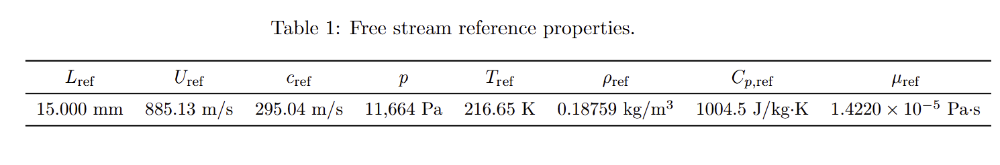
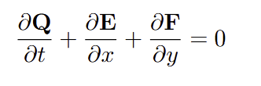
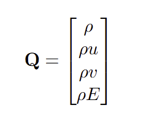
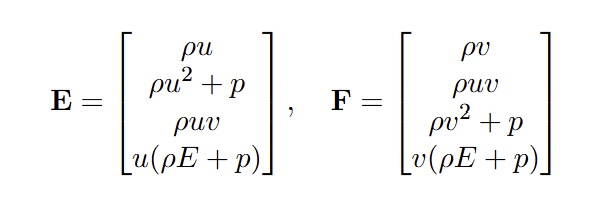
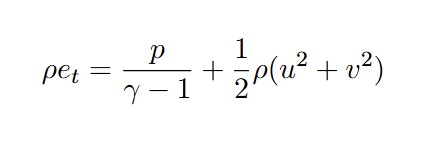
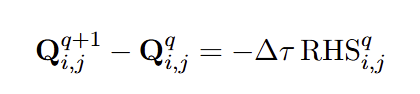
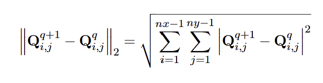
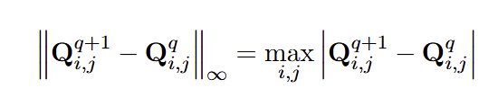

# 2D Inviscid Euler Solver using Finite Volume Method (Steger-Warming Flux Splitting)

## Overview

This project implements a 2D finite volume solver for the inviscid Euler equations using the **Steger-Warming flux vector splitting** method. The goal is to numerically solve various compressible flow problems and validate the solver across three canonical test cases involving oblique shock waves and expansion fans.

The solver targets the conservative form of the Euler equations, discretized on a structured grid. The flux vector splitting technique enables stable upwinding in supersonic and transonic regimes by decomposing the fluxes based on the sign of the eigenvalues.

## Objectives

- Implement a conservative finite volume method for 2D Euler equations.
- Use Steger-Warming flux vector splitting for accurate shock capturing.
- Simulate and analyze:
  - Supersonic compression corners (oblique shocks)
  - Supersonic expansion corners (Prandtl-Meyer fans)
  - Oblique shock reflection from a wall
- Validate numerical results against analytical oblique shock and expansion theory.

## Freestream Reference Properties

## Governing Equations

The 2D Euler equations in conservative form are:

The conserved variable vector is:

The convective flux vectors in the x and y directions are:

## Numerical Method

- **Spatial Discretization**: Finite Volume Method (FVM) on a Cartesian mesh
- **Flux Evaluation**: Steger-Warming flux vector splitting
- **Temporal Scheme**: Explicit time stepping (Forward Euler)

## Initial and Boundary Conditions

Assume that the static pressure, temperature, and Mach number at the inlet are 11,664 Pa, 216.7 K, and \( M = 3.000 \), respectively, with a flow direction parallel to the Cartesian x-axis. This translates to an axial convective velocity of 885.0 m/s since the speed of sound for the conditions given is 295.0 m/s.

Using these conditions, the state vector \( \mathbf{Q} \) must be evaluated in all of the inlet boundary halos. Also use these values as the initial condition for all of the interior cells at the beginning of the calculation.

This can be accomplished using the thermodynamic properties given above and recalling that:

## Convergence Criteria

Time-marching methods for steady-state problems in CFD use pseudo-time stepping to drive the residual to zero. The governing discrete system is:

To monitor convergence, we define norms of the residual as follows:

**L2-Norm**:

**L∞-Norm**:

These norms quantify how close the numerical solution is to convergence.

## Test Cases

### Case 1: Oblique Shock from Wedge
- Flow over a compression ramp (wedge with deflection angle)
- Expected: Oblique shock attached at the wedge corner
- Analytically validated using oblique shock relations

### Case 2: Expansion Corner (Prandtl-Meyer Fan)
- Flow over an expansion ramp
- Expected: Prandtl-Meyer expansion fan emanating from the corner
- Analytically validated using expansion theory

### Case 3: Oblique Shock Reflection
- A reflected oblique shock interacting with a wall
- Shock impinges and reflects, producing a complex flow pattern
- Demonstrates capability of solver to capture shock-shock and shock-wall interactions

## References

1. **AIAA 2001-2609**, Radespiel & Kroll: *Accurate flux vector splitting for the Euler equations*.
2. Anderson, J. D. *Modern Compressible Flow: With Historical Perspective*, 3rd ed.
3. Hirsch, C. *Numerical Computation of Internal and External Flows*, Vol. 2.
4. Lecture slides and class materials from AE 6042 (Spring 2025).
